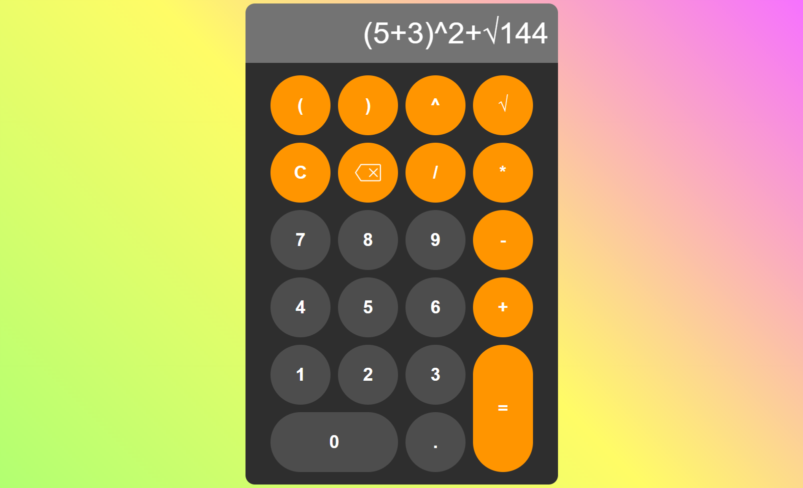

# Calculator Project

Une calculatrice simple et intuitive développé en Vanilla JS (Javascript pur)

## État actuel (0.2.0)

L'application est fonctionnelle pour les calculs basiques.

- [x] Operateurs standards (+,-,\*,/).
- [x] Support clavier(Chiffres, opérateurs, Entrée, Effacer).
- [x] Gestion des erreurs de syntaxes.
- [x] Corrections des bugs de focus liés à l'interface navigateur.
- [x] Fonctions avancées : Parenthèses, Racine carrée (`√`) et Exposants (`^`)

## Roadmap

Le projet est toujours en cours de production. Les fonctionnalités suivantes sont prévues :
- [ ] Thème sombre/clair : Personnalisation de l'interface.
- [ ] Historique de Calculs
